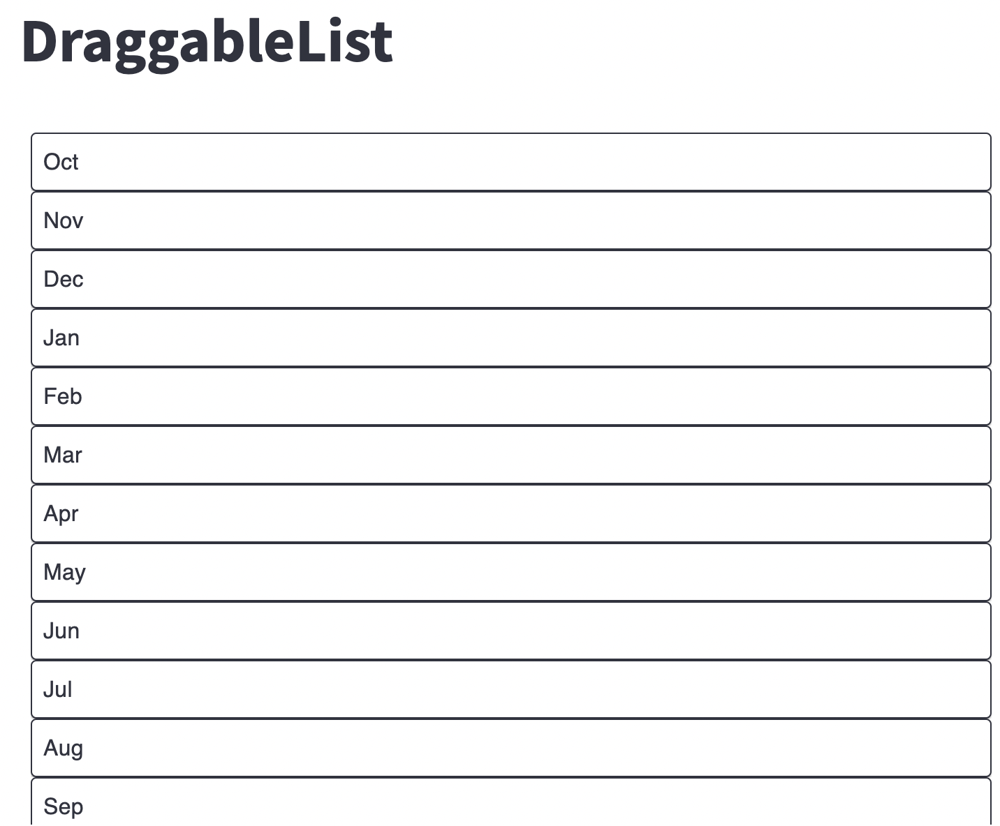
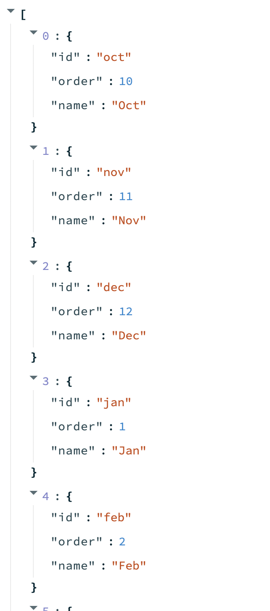

# streamlit-draggable-list
A Streamlit wrapper component on react-smooth-dnd

### Exmple
```python
import streamlit as st
from st_draggable_list import DraggableList

st.title("DraggableList")

data = [
    {"id": "oct", "order": 10, "name": "Oct"},
    {"id": "nov", "order": 11, "name": "Nov"},
    {"id": "dec", "order": 12, "name": "Dec"},
    {"id": "jan", "order": 1, "name": "Jan"},
    {"id": "feb", "order": 2, "name": "Feb"},
    {"id": "mar", "order": 3, "name": "Mar"},
    {"id": "apr", "order": 4, "name": "Apr"},
    {"id": "may", "order": 5, "name": "May"},
    {"id": "jun", "order": 6, "name": "Jun"},
    {"id": "jul", "order": 7, "name": "Jul"},
    {"id": "aug", "order": 8, "name": "Aug"},
    {"id": "Sep", "order": 9, "name": "Sep"},
]

slist = DraggableList(data, width="100%")
st.write(slist)
```


### Component value


### Install
```
pip install streamlit-draggable-list
```
